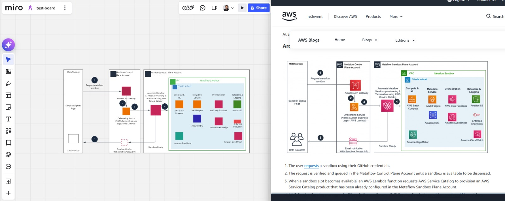

# img2miro

Convert a diagram image into **editable items on a Miro board** — shapes, text, and connectors that mirror the original as closely as possible: same text, colors, fonts, positions, and arrow routing.

It works by handing the image to Claude through the [Claude Agent SDK](https://platform.claude.com/docs/en/agent-sdk) (so conversions bill your Claude subscription, not an API key), extracting every element as strict JSON validated against a schema, normalizing the layout, and recreating it through the Miro REST API v2.

## Example

Left: the result on a Miro board, fully editable. Right: the original diagram (an AWS architecture from the AWS blog).



Icons and logos can't be reproduced in Miro, so they become placeholder squares in the icon's dominant color, with their captions placed exactly where the text sits in the original.

## Setup

Requires Python 3.10+ and [Claude Code](https://claude.com/claude-code).

```bash
git clone https://github.com/rodrigorbenitez/img2miro.git
cd img2miro
pip install -e .
```

### Credentials

The tool needs two things: a **Claude Code login** (for the vision extraction, billed to your Claude subscription) and a **Miro access token** (to create items on your board).

**1. Claude account (vision extraction)**

1. Install Claude Code: `npm install -g @anthropic-ai/claude-code` (or use the [native installer](https://claude.com/claude-code)).
2. Run your first conversion — a browser page opens where you **sign in with your Claude account**, and the conversion continues from there. (You can also sign in ahead of time with `claude auth login`.)
3. You need a **Claude Pro or Max subscription** — the free plan won't work.

That's it — no API key. Conversions draw from your subscription's usage allowance (see [Costs](#costs)). The sign-in happens once per machine; after that, conversions run without any prompt.

**Headless machines (CI, servers):** instead of an interactive login, create a long-lived token with `claude setup-token` on a machine where you're logged in, then set it as the `CLAUDE_CODE_OAUTH_TOKEN` environment variable on the headless machine.

> If you still have `ANTHROPIC_API_KEY` set from an older version of this tool, it is now **ignored** — the tool warns you at startup so nothing gets silently billed to it. You can remove it from your `.env` and environment.

**2. Miro access token**

Provide `MIRO_ACCESS_TOKEN` either with a `.env` file or as a regular environment variable — both work on every platform. If both are set, the environment variable wins.

*Option A — `.env` file (recommended: set once, works in every terminal)*

Copy the template in the project root and fill in your own value:

```bash
cp .env.example .env        # macOS/Linux
copy .env.example .env      # Windows
```

```
MIRO_ACCESS_TOKEN=...
```

Format rules: one `KEY=value` per line, no quotes, no spaces around the `=`. Run the tool from the project directory (or a subdirectory) so the file is found.

*Option B — environment variable in the terminal*

```bash
export MIRO_ACCESS_TOKEN="your-miro-token"      # macOS/Linux (bash or zsh)
```

```powershell
$env:MIRO_ACCESS_TOKEN = "your-miro-token"      # Windows (PowerShell)
```

These last only for the current terminal session. To make it permanent: on macOS/Linux add the `export` line to your shell profile (`~/.zshrc` on macOS, `~/.bashrc` on most Linux); on Windows run `setx MIRO_ACCESS_TOKEN "your-miro-token"`, then open a new terminal (`setx` does not affect the current one).

**Getting the Miro access token**

1. Sign in at [miro.com](https://miro.com) and open the [Developer Apps page](https://miro.com/app/settings/user-profile/apps) (Profile settings → Your apps → Create new app).
2. Create an app, and under **Permissions** enable the `boards:read` and `boards:write` scopes.
3. Click **Install app and get OAuth token** and install it on the team that owns your target board.
4. Copy the access token shown after installing.

You'll also need the **board id**: it's the part of the board URL after `/app/board/`, e.g. for `https://miro.com/app/board/uXjVAbCdEfG=/` the id is `uXjVAbCdEfG=`.

### Keeping credentials out of the repo

- `.env` is listed in `.gitignore`, so git never tracks it — your token stays on your machine. Only `.env.example` (placeholders, no real values) is committed.
- Never paste real tokens into `README.md`, code, commits, or issues. If a token does leak, revoke and regenerate it (Miro → your app settings; for a leaked `CLAUDE_CODE_OAUTH_TOKEN`, revoke it from your Claude account).
- Each machine you run the tool on needs its own credentials (its own Claude Code login and its own `.env` or environment variables) — they deliberately do not travel through git.
- Terminal-set variables are just as safe as `.env` as long as you avoid putting the `export`/`setx` lines (with real values) in files that get committed.

## Usage

```bash
python -m img2miro path/to/diagram.png --board <your-board-id>
```

| Option | Description |
| --- | --- |
| `--board <id>` | Target Miro board id |
| `--model <name>` | Claude model: `claude-fable-5` (default, most capable), `claude-opus-4-8` (lighter on usage limits), `claude-sonnet-4-6` (lightest/fastest) |
| `--refine` / `--no-refine` | Second vision pass that audits the extraction against the image (default: on) |

Supported input formats: PNG, JPEG, GIF, WebP — and **SVG**, which is read as source markup for even higher fidelity (exact coordinates, colors, and text come straight from the file).

## How it works

1. **Extract** — a Claude agent (run via the Claude Agent SDK, with the image as its only readable input) returns strict JSON validated locally against a pydantic schema: every shape with its geometry, colors, border style, font, and verbatim text; standalone text labels at their exact positions; every connector with its precise attachment points and arrowheads.
2. **Refine** (optional) — a second pass compares the JSON against the image field by field and corrects it.
3. **Normalize** — a geometric pass enforces what the model can't guarantee: text always fits its shape, nested shapes sit fully inside their containers, circles stay circular.
4. **Push** — shapes (largest first, for z-order), then text labels, then connectors are created on the board via the Miro REST API v2.

## Costs

Miro's API is free to use. Conversions run through the Claude Agent SDK and draw from your Claude subscription's usage allowance — there is no per-token API billing. Each conversion uses one model session per pass (two with the default refine pass); `--no-refine` halves the usage, and `--model claude-opus-4-8` or `--model claude-sonnet-4-6` consume less of your allowance than the default. If you hit your plan's usage limit, conversions fail until the limit window resets.

## Limitations

- Icons/logos become colored placeholder squares (Miro has no icon items).
- Fonts map to Miro's catalog (Open Sans / PT Serif / Caveat) — exact typefaces can't be matched.
- Connector endpoints are pinned to the exact spots from the image, but the path between them is drawn by Miro's router.

## Development

```bash
python -m unittest discover tests
```

Tests cover the mapping and layout layers with a fake Miro client — no network calls.
